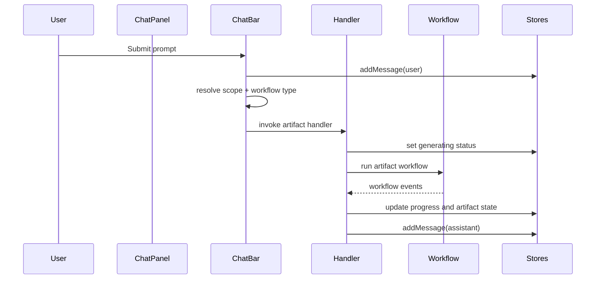
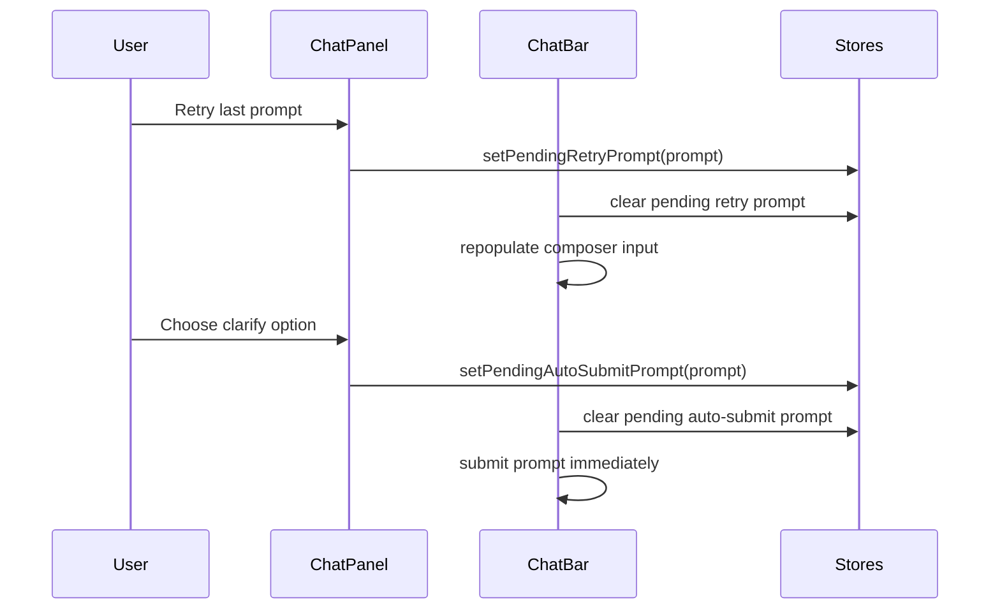

# Workflow Contracts

This document is the Phase 0 source of truth for Aura's current workflow boundary before the explicit contract refactor in Phase 1.

## Current Runtime Boundary

| Area | Current responsibility |
| --- | --- |
| `src/components/ChatBar.tsx` | Builds scoped prompt input, selects the artifact workflow, creates the user chat message, and invokes the artifact handler. |
| `src/components/chat/handlers/presentationHandler.ts` | Presentation-specific orchestration, ambiguity preflight, workflow event handling, store mutation, version history, and memory extraction scheduling. |
| `src/components/chat/handlers/documentHandler.ts` | Document-specific orchestration, project link gathering, workflow event handling, store mutation, version history, and memory extraction scheduling. |
| `src/components/chat/handlers/spreadsheetHandler.ts` | Spreadsheet workflow dispatch plus store mutation for sheet creation, sheet actions, and chart insertion. |
| `src/stores/chatStore.ts` | Chat timeline, generation status, pending retry prompt, pending auto-submit prompt, message visibility mode, and token estimate. |
| `src/stores/projectStore.ts` | Project data, active document selection, document mutation, and project-level chat history persistence. |
| `src/services/ai/workflow/types.ts` | Shared workflow event taxonomy and provider config shape for the current workflow runtime. |

## Workflow Events In Use

Current event types emitted through `WorkflowEvent`:

- `step-start`
- `step-done`
- `step-error`
- `step-skipped`
- `step-update`
- `streaming`
- `progress`
- `retry-attempt`
- `draft-complete`
- `batch-slide-complete`
- `complete`

## Store Mutation Points

- `ChatBar` adds the user message before invoking any handler.
- Presentation and document handlers add the assistant completion message and mutate the active or newly created document.
- Spreadsheet handler mutates the workbook or chart-bearing document and adds its assistant summary message.
- `commitVersion()` is invoked by each artifact handler after a successful artifact mutation.
- Memory extraction is queued only by the document and presentation handlers.

## Current Sequence

## Known Phase 0 Gaps

- Routing intent is still implicit and split between `ChatBar` and artifact handlers.
- User-facing text is still authored inline instead of being rendered from structured run results.
- Context assembly is spread across `ChatBar`, handlers, and workflow internals.
- Cancel support exists only where handlers keep an `AbortController` alive.
